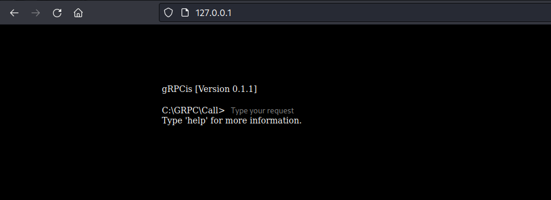

# <p align="center">gRPCis<br>   </p>
This is a system consisting of several microservices (Memory Balancer, Storage, WebApplication), 
which is a distributed key-value database. 

There can be an unlimited number of Storage instances, they are all connected to the Memory Balancer via gRPC, 
which distributes the load between them. 

You can connect to the Web Application (Echo) via the Web interface to enter the necessary data manually.
<p align="center" >

</p>

# <p align="center">Quick start</p>

## Server with Memory Balancer
```bash
go run cmd/balancer/main.go -a=':PORT' -d='MONGODB_URI'
```

## Server with WebApplication
```bash
go run cmd/grpc-storage-cli/main.go -a=':PORT' -b='BALANCER_IP:BALANCER_PORT'
```

## Server (or servers) with Storage instance
```bash
go run cmd/grpc-storage/main.go -a=':PORT' -d='MONGODB_URI' -connect='BALANCER_IP:BALANCER_PORT'
```

# <p align="center"> Preview of the WebApplication  </p>

## Demo: https://grpc-storage.egorpoletaikin.repl.co
  
## Main page
  


## Help command
set key value   
get key  
history
